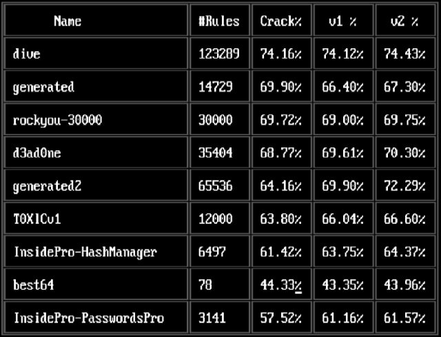
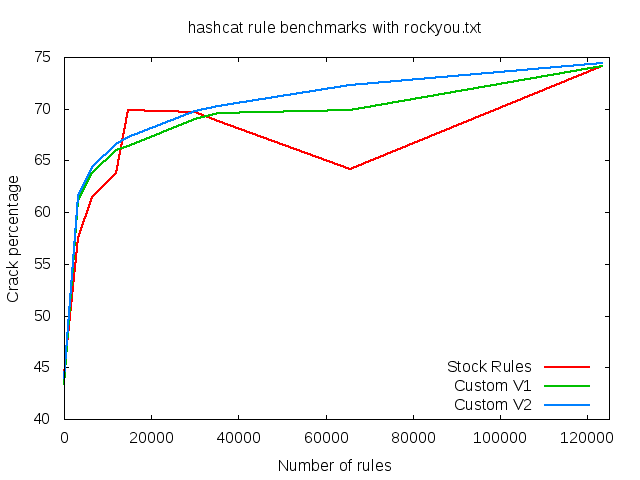

# nsa-rules

## Back Story

In October/November 2014, I attended PhreakNIC 18 in Nashville. I had been playing around with hashcat in the weeks before the con, and asked one of the organizers if a talk about password cracking was something they would want in the future. After getting some words of encouragement, I went to work. That lead to [HASHCAT: GPU PASSWORD CRACKING FOR MAXIMUM WIN](http://www.slideshare.net/_NSAKEY/hashcat-gpu-password-cracking-for-maximum-win-57720263), which I presented at multiple local conferences in 2015 (Including PhreakNIC 19). In the slides for that talk, the effectiveness of different rule sets and dictionary combinations was measured. The Battlefield Heroes Beta hashes from 2011 were used in testing, partly because they were unsalted MD5 (And would crack quickly on my GTX 650 Ti BOOST) and partly because the dump was so old that nobody could possibly get mad over it being used in research. This later turned into me trying to make my own rule sets and mask files using [PACK](https://thesprawl.org/projects/pack/). The results of that work can be found in this project.

## The Files

**_NSAKEY.v1.dive.rule** is the first version of my rule set which I used to compete against dive.rule. It has 123289 rules, just like the real dive.rule.

**_NSAKEY.v2.dive.rule** is the improved version of my attempt to compete against dive.rule. You can use "head -n X" (With X being a number between 1 and 123289) and the output to another file if you want to create a smaller rule set.

**bench.png** is the pretty graph shown below.

**nsa64.rule** is the first 64 rules from _NSAKEY.v2.dive.rule. For the record, it cracked 42% of the Battlefield Heroes Beta hashes. best64.rule is unquestionably better, but maybe this set of rules will be helpful to someone.

**nsa.hcmask** is the result of feeding my second dictionary of passes from breaches into PACK's mask generating script. I took each mask that had over 100k matches and dumped into nsa.hcmask. If you actually use this entire set of masks, the heat death of the universe will happen before it finishes, so feel free to hand-prune the longer masks.

**pwcrack.sh** is the script I used to keep the benchmark commands consistent. The script itself is heavily commented, so check it out if you want to know more. If you're a hashcat newbie of the "please give me a command to run" variety, this script should be manna from the heavens.

**README.md** You are here.

**table.png** A screenshot from my presentation that shows the effectiveness of the rules I generated vs what comes bundled in hashcat.

## Graph & Explanation

This section's going to be long, so I put it at the bottom. If you want technical explanations, you're in the right section. Here's a table of how the different rules performed against each other, lifted directly from my slides:

... And here's a graph using those numbers.

Explanation: I took a count of the number of rules in each rule set that comes with cudaHashcat (1.3.1 or so, if anyone cares). Then, I downloaded a bunch of cracked passwords from previous data breaches and made two dictionaries out of them (More on that below). Those dictionaries were then fed to PACK, which generated rules based on the passes. The end result was two lists of rules ranked by most to least common. From there I simply used "head -n X" and redirected to a text file, and I magically had rule sets which contained the same number of rules as those found in hashcat. The table and graph show the results of my 3-way head-to-head competition.

As for the table's columns themselves, here's what each one represents:

The **Name** column shows the name of the rule set.

The **#Rules** column lists the number of rules in a given rule set.

**Crack%** is the percentage cracked from Battlefield Heroes using rockyou.txt as a dictionary. I actually ran all of the stock rules to get the crack percentages for each. Later, when I got the idea to try making my own rules, I took the top performers from the stock ruleset benchmarks and only did my head-to-head benchmarks against those.

**v1 %** represents the first attempt I made at generating rules. I had a ~3GB dictionary and fed it into [PACK](https://thesprawl.org/projects/pack/). This gave me 50GB of rules, which took roughly 2 or 3 days to generate on my desktop. That was too large for PACK. to depuclicate and rank by most to least common, so I had to sort them by popularity with sort and uniq. The dictionary was a combination of rockyou.txt, crackstation-human-only.txt, every found password on [hashes.org](http://hashes.org/public.php) as of around Feb. 2015, as well as everything on [http://www.adeptus-mechanicus.com/codex/hashpass/hashpass.php](adeptus-mechanicus.com). This version even included the found passes from various cracking competitions, which as the graph shows hurt my results slightly.

**v2 %** represents the results from my second attempt at making rules. The v2 dictionary is just the v1 dictionary without the cracking competition passwords. Since the cracked percentages are slightly higher, I think it's safe to say that this is a solid case of "less is more" in action. In case you're curious, the raw rules file PACK generated was 15GB before de-duplication.

## Conclusion

hashcat's stock rule sets are very good, and you're probably not going to be able to generate rules which greatly outperform them based on statistics alone. Some hand-tuning is required. This is best seen in the 3-way fight between best64.rule and my two attempts to build a better version of it. If you do, you're likely to run into a situation similar to the reason best64.rule actually has 78 rules. Short version of that story: 14 of the rules did really good with the hashlist/dictionary that everyone had to use in the competition to make best64, but those rules didn't crack anything in the real world. 14 more rules were thrown in to compensate, while the originals were left in because they were so computationally cheap to run.
